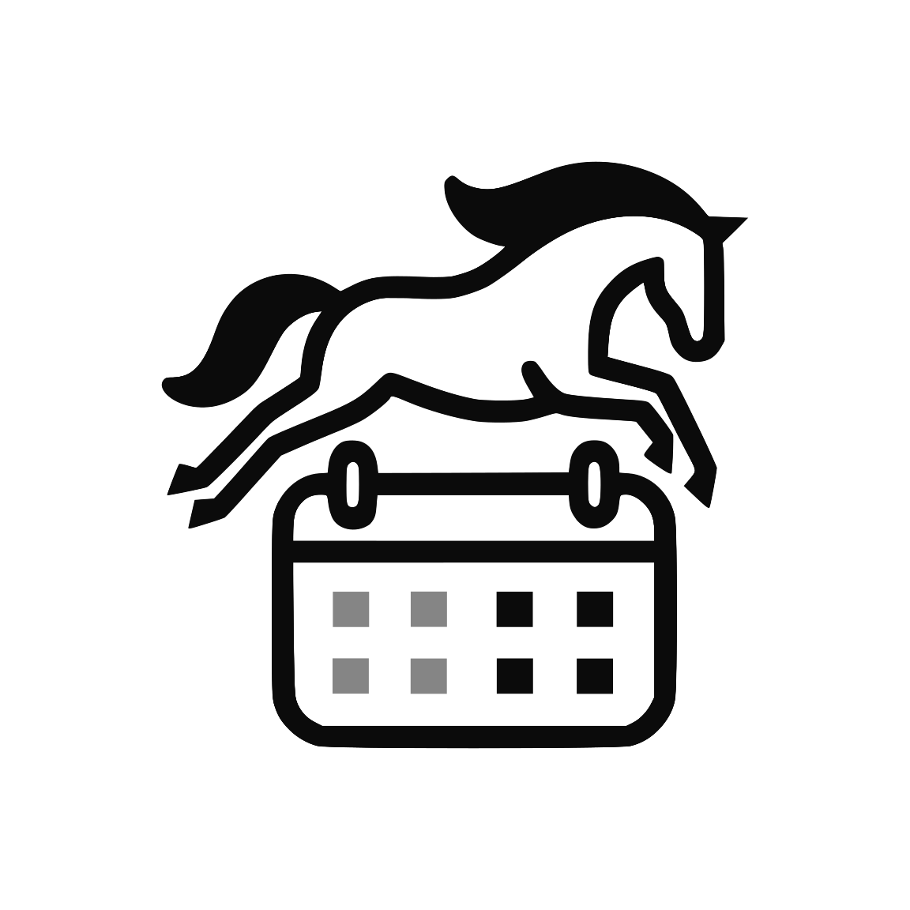

# GallopGate

  
Modo Oscuro

  

  
Modo Claro

  

## Description

La idea detrás de este proyecto es hacer la vida más fácil en la gestión de centros ecuestres.
Este servicio proporcionará las siguientes características básicas:

- Gestión de usuarios
- Gestión de caballos
- Gestión de horarios
- Gestión de clases
- Gestión de eventos
- Gestión de organizaciones

## Autor

> Vladislav Zernov Kuznetsov
> - [GitHub](https://github.com/zervladpy/)

## Licencia

> Este proyecto está licenciado bajo la Licencia MIT. Consulta el archivo [LICENSE](LICENSE) para más detalles.

##  Tabla de Contenidos
1. [Estudio Preliminar](docs/preliminary_study.md)
2. [Análisis](Análisis.md)
   - [Planificación](docs/planificacion.md)
   - [Presupuesto](Presupuesto.md)
3. [Diseño](docs/diseno.md)
4. [Codificación y Pruebas](docs/codificacion_pruebas.md)
5. [Manuales del Proyecto](Manuales.md)
   - [Referencias](docs/referencias.md)
6. [Uso de Git](docs/uso_git.md)

## Impulsado por

> Diseñado con la ayuda de:

> Servidor

> Cliente

> Control de versiones

