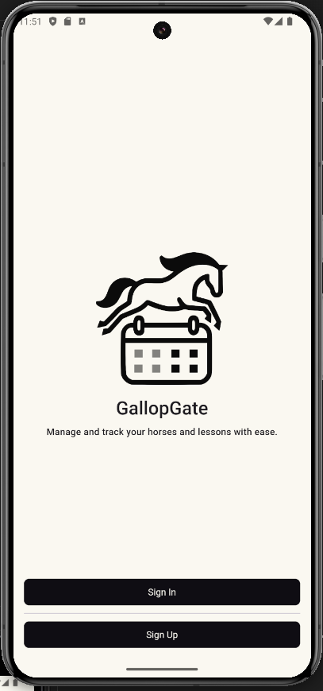
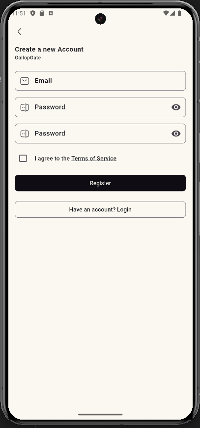

# Codificación y Pruebas 

## Tabla de Contenidos

- [Funcionalidades](#funcionalidades)
- [Problemas y Soluciones](#problemas-y-soluciones)

---

## Funcionalidades

| Característica                      | Progreso |
| ----------------------------------- | -------- |
| Autenticación de Usuario y Perfiles | 90%      |
| Gestión de Organización             | 60%      |
| Funciones de Programación           | 40%      |
| Gestión de Cuidado de Caballos      | 30%      |
| Gestión de Eventos                  | 30%      |
| Herramientas de Comunicación        | 0%       |
| Panel de Administración             | 60%      |
| Accesibilidad y Usabilidad          | 10%      |

---

## Innovación

Durante el curso he notado la falta de ver contenido más o menos actualizado por lo que he decido seguir a pie de la letra el no tocar absolutamente nada visto en el transcurso del ciclo. Ya que a mi punto de vista son enseñanzas fijas, sin articulación y muy incómodas de utilizar.

He comenzado a hacer este proyecto hace la sorprendente cantidad de 2 años, en los cuales he probado muchas combinaciones de sistemas, como:
- [FastApi]() `python`
- [Django]() `python`
- [Compose]() `kotlin` (no esta listo para producción)
- [Flutter]() `dart`
- [React]() `javascript`

En clase he probado también cosas como:
- [Swing]() `java` (no lo vuelvo a tocar ni aun que me paguen)
- [JavaFX]() `java`

Y servicios como:
- [Supabase]() `Backend as a Service RELACIONAL`
- [Firebase]() `Backend as a Service NO RELACIONAL`

Las tecnologías elegidas han sido **Flutter** y **Supabase**.

> **Flutter**: Es una tecnología que permite escribir una vez, ejecutar en todos lados. Utiliza una moderna interfaz basada en [Material3]() y una cantidad inmensa de extensiones que facilitan mucho el proceso del desarrollo al no tener que buscar una solución por tu cuenta, por lo que es mi preferida, al menos, para el MVP del proyecto.

> **Supabase**: Es un denominado `backend as a service` lo cual significa que montan todo el servicio por ti, en lo que solo te tienes que preocupar es montar bien las relaciones y las reglas de seguridad. Todo lo demás como la autentificación, API, ... entre otros ya están configurados y listos para su uso. 

---

## Problemas y Soluciones

Durante el desarrollo de la aplicación he encontrado varios fallos de diseño iniciales como la mala gestión de la base de datos, o poco conocimiento en las tecnologías con las que iba a trabajar.

### Mala Gestión de la Base de Datos

Durante mucho tiempo he pensado que sería una forma muy rápida y eficaz para un solo desarrollador utilizar un servicio como [Firebase](https://firebase.google.com/?hl=es) ya que permitía no fijarme tanto en el **back end** y centrarme en la parte visual de la aplicación ya que esta es la parte que peor llevo.

El problema que he encontrado es relacionado con como los datos son guardados y relacionados, esto es muy complicado para mi relacionar y mantener la consistencia de los mismos.

La **SOLUCIÓN** que he encontrado es migrar el proyecto a un servicio que yo personalmente solo conocía por algunas veces que he visto en internet y como mucha gente lo recomendaba. El servicio en cuestión se llama [**Supabase**](https://supabase.com/) y ofrece casi todo lo que ofrece **Firebase** pero con un sistema de gestión de la base de datos **RELACIONAL**.

### Diseño Gráfico de la Aplicación

Siendo un desarrollador dedicado al **back end** , mi experiencia diseñando interfaces es pésima.

La única solución que he encontrado es utilizar un servicio como [**dev.0**]() para diseñar una interfaz mediante una inteligencia artificial, o por lo menos tener una idea con la que trabajar después.

### Falta de Tiempo

Esto es a efecto práctico, que es imposible solucionar. Durante estos dos meses he estado la mayor parte del tiempo documentandome sobre como abarcar un proyecto tan grande siendo solo una persona.

Mis condiciones tanto personales como profesionales no han estado a la altura con un continuo estrés que supone llevar mas de 1 proyecto en solitario, con fechas de entrega iguales.

---

## Prototipos

### Prototipo 1

En este prototipo he incluido:

- El servicio de autentificacíon con las principales funcionalidades de registro y login. 

|      **Pantalla principal de autentificación**        |          **Términos y Condiciones**           |
| :------------------------------------------------------: | :----------------------------------------------: |
|   |  |
|               **Pantalla de Registro**                |              **Pantalla de login**               |
|     |   |

- Servicio de rutas de aplicación como varias pantallas que servirán de base para la organización del desarrollo

> Fallo conocido que no he encontrado solución de momento es en el momento de login, no recoge bien la `id` del usuario y salta error, pero si autentifica al usuario. 
> La solución momentánea es reiniciar la aplicación.

### Prototipo 2

En este prototipo se incluyen las funciones:

- Crear organizaciones

- Actualizar el perfil

- Crear nuevos miembros (aunque no se mande el correo conforme se creo el usuario, este si se registra ya pertenecerá a una organización)

- CRUD sobre todas las entidades

> Algunas pantallas implementadas

|                **Detalles de Organización**                 |               **Pantalla de ajustes de cuenta**               |
| :---------------------------------------------------------: | :-----------------------------------------------------------: |
|             |    |
|                     **Añadir usuarios**                     |                  **Listado de usuarios**                   |
|         |     |
|             **Como se introduce una hora**               |                 **Detalles de Caballos**                   |
|             |       |
|                     **Pantalla Inicio**                     |                    **Pantalla Calendario**                    |
|        |  |
|                    **Pantalla Horario**                     |                  **Indicador de Actualizar**                  |
|    |         |
|                 **Añadir miembro a clase**                  |                                                               |
|  |                                                               |

